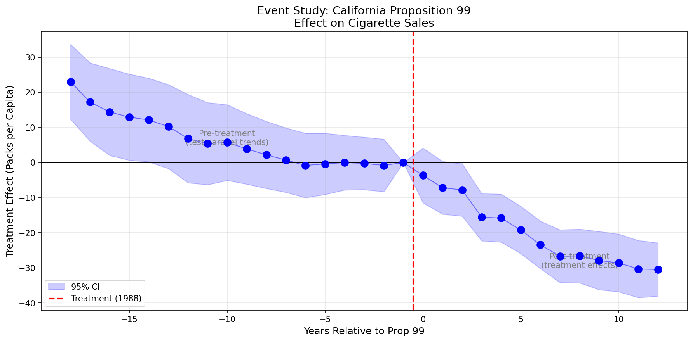

# Module 02: Event Study (2×T Design)

> "An event study is just a series of 2×2 comparisons normalized to a reference period."

## 1. The Problem

The canonical 2×2 gives us a single number. But we often want to:
1. **Test parallel trends:** Were treated and control groups moving together *before* treatment?
2. **See dynamics:** Does the effect grow, shrink, or stay constant over time?

This requires extending from 2 periods to T periods.

## 2. The Target Parameter

For each time period $t$, we estimate:

$$ATT(t) = E[Y_t - Y_{ref} | D=1] - E[Y_t - Y_{ref} | D=0]$$

where $ref$ is the reference period (typically $t = g-1$, the period just before treatment).

**Key insight:** Each coefficient is a 2×2 DiD comparing period $t$ to the reference period.

## 3. Assumptions

The formal identification assumptions for the event study DiD (California Prop 99 tobacco tax):

1. **Parallel Trends (Pre & Post):** Absent the tax, cigarette sales in California would have evolved in parallel to the Control states for *every* time period $t$.
   - *Intuition:* California's cigarette consumption would have tracked other states' trends without the intervention.

2. **No Anticipation:** Consumers did not change purchasing behavior (hoarding or quitting) in the years leading up to 1989 specifically because they knew the tax was coming.
   - *Intuition:* No stockpiling cigarettes or preemptive quitting before 1988.

3. **Treatment Irreversibility:** The treatment is an "absorbing state." Once California enacts the tax, it does not repeal it during the study window.
   - *Intuition:* Once the tax is passed, it stays passed (treatment status doesn't switch on and off).

4. **Sampling Stability:** The composition of the control group (the other 38 states) remains stable over time.
   - *Intuition:* No states entering/exiting the sample during the study period.

## 4. The Data

**California Proposition 99 (1988)** - Tobacco tax and cigarette sales.

| Variable | Description |
|----------|-------------|
| state | State name |
| year | Year (1970-2000) |
| cigsale | Cigarette sales per capita (packs) |
| treated | 1 if California, 0 otherwise |

**Treatment:** California passed Prop 99 in 1988, implementing a 25-cent tax on cigarettes.

**Reference period:** 1987 (year before treatment)

## 5. The Solution (Forward-Engineering)

### Step 1: Set the Reference Period

Choose $t_{ref} = 1987$ (the year immediately before treatment in 1988).

### Step 2: Loop Over All Years

For each year $t \in \{1970, ..., 2000\}$:

```python
# Slice data to just year t and reference year
df_t = df[df['year'].isin([t, t_ref])]

# Calculate 2x2 DiD
delta_treat = mean(Y_t | treated) - mean(Y_ref | treated)
delta_control = mean(Y_t | control) - mean(Y_ref | control)
ATT_t = delta_treat - delta_control
```

### Step 3: Normalize

The coefficient at $t = t_{ref}$ is normalized to 0 because we are subtracting the reference year from itself ($Y_{ref} - Y_{ref} = 0$). In the regression, this is handled by dropping the dummy variable for 1987.

### Step 4: Plot

Create an event study plot with:
- X-axis: Time relative to treatment (or calendar time)
- Y-axis: ATT(t) coefficients
- Confidence intervals
- Vertical line at treatment

## 6. Results & Visualization

### Pre-Trends Test

Coefficients for years before 1988 should be:
- **Statistically insignificant** (close to zero)
- **No systematic pattern** (not trending up or down)

If pre-trends are violated, the parallel trends assumption is suspect.

### Post-Treatment Effects

Coefficients for years 1988+ show the dynamic treatment effect:
- Immediate effect in 1988
- Growing effect as California's smoking rates diverge from other states



## 7. How to Run

```bash
cd 02_event_study_2xT
python main.py
```

## 8. Key Takeaways

1. **Event studies are 2×2s in a loop:** Each coefficient compares year $t$ to the reference year
2. **Pre-trends matter:** Non-zero pre-period coefficients suggest parallel trends violation
3. **Reference period normalization:** One period must be dropped (set to 0)
4. **Dynamics revealed:** We see how effects evolve over time

## 9. Common Pitfalls

| Issue | Solution |
|-------|----------|
| Pre-trends not flat | Conditional parallel trends (Module 04) |
| Staggered treatment | Callaway-Sant'Anna (Module 03) |
| Anticipation effects | Move reference period earlier |
| Only 2 periods | Back to Module 01 |

## References

- Abadie, A., Diamond, A., & Hainmueller, J. (2010). Synthetic Control Methods for Comparative Case Studies. *Journal of the American Statistical Association*.
