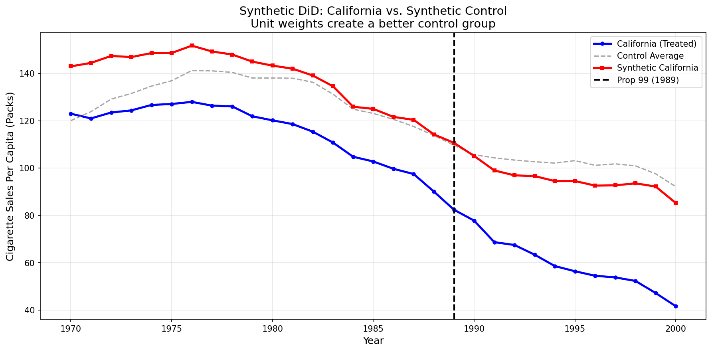

# Module 07: Synthetic Difference-in-Differences

> "SDID is just weighted DiD—but the weights are chosen to make the parallel trends assumption more plausible."

## 1. The Problem

You want to evaluate a policy that affected **one unit** (e.g., California). Standard methods have limitations:

### Naive DiD
```
ATT = (CA_post - CA_pre) - (Avg_Other_post - Avg_Other_pre)
```
**Problem:** The average of other states may be a poor control for California. If pre-trends don't match, the parallel trends assumption fails.

### Synthetic Control (SC)
Reweights control units to match California's pre-treatment trajectory:
```
Synthetic_CA = 0.3 × Utah + 0.2 × Nevada + ...
```
**Problem:** SC ignores time-varying unobservables. It's not invariant to additive shifts in outcomes.

### The Solution: SDID

**Synthetic Difference-in-Differences** combines the strengths of both:
1. **Unit Weights (ω):** Like SC, reweight control units to match pre-trends
2. **Time Weights (λ):** NEW! Reweight pre-treatment periods to resemble post-treatment
3. **Double Robustness:** Combines two-way fixed effects with synthetic control weighting

## 2. The Math

The SDID estimator is:

```
τ_SDID = (μ₁₁ - μ₁₀) - (μ₀₁ - μ₀₀)
```

where:
- **μ₁₁** = mean(Y_post | Treated) — Treated unit, post-treatment
- **μ₁₀** = Σ(Y_pre × λ | Treated) — Treated unit, pre-treatment (**time-weighted**)
- **μ₀₁** = mean(Y_post @ ω | Control) — Controls, post-treatment (**unit-weighted**)
- **μ₀₀** = Σ((Y_pre @ ω) × λ | Control) — Controls, pre-treatment (**both weighted**)

### Unit Weights (Omega)

Find ω such that the synthetic control matches the treated unit's pre-trend:

```
min ||Y_pre_treat - (α + Y_pre_ctrl @ ω)||² + ζ||ω||²
s.t. Σω = 1, ω ≥ 0
```

### Time Weights (Lambda)

Find λ such that weighted pre-periods resemble post-periods:

```
min ||mean(Y_post_ctrl) - (α + Y_pre_ctrl.T @ λ)||²
s.t. Σλ = 1, λ ≥ 0
```

**Intuition:** Down-weight early pre-treatment years that look very different from the post-treatment period.

## 3. Assumptions

The formal identification assumptions for Synthetic Difference-in-Differences:

1. **Latent Factor Structure:** The data generating process is governed by latent unit factors ($\alpha_i$) and time factors ($\beta_t$) interacting ($L = \Gamma \Upsilon^T$).
   - *Intuition:* Outcomes are driven by underlying common factors that affect units differently based on their factor loadings.

2. **Strict Exogeneity:** The error term $\varepsilon_{it}$ is independent of the treatment assignment $W_{it}$ (conditional on the latent factors).
   - *Intuition:* Treatment timing is not driven by idiosyncratic shocks to the outcome.

3. **Convex Hull (Feasibility):** It is possible to construct a weighted average of control units that approximates the pre-trend of the treated unit.
   - *Intuition:* The treated unit is not an extreme outlier that cannot be matched. California's pre-1988 cigarette trends can be approximated by a weighted combination of other states.

4. **No Anticipation:** The outcome in pre-periods is not affected by future treatment.
   - *Intuition:* California's cigarette sales before 1988 were not affected by knowledge of the upcoming tax.

## 4. The Data

We use the **California Proposition 99** dataset (same as Module 02):

| Variable | Description |
|----------|-------------|
| `state` | State name (California = treated) |
| `year` | Year (1970-2000) |
| `cigsale` | Cigarette sales per capita (packs) |

**Treatment:** Proposition 99 (1988) — 25-cent tobacco tax increase

**Setup:**
- Pre-treatment: 1970-1988 (19 years)
- Post-treatment: 1989-2000 (12 years)
- Treated: California (1 state)
- Controls: 38 other states

## 5. The Solution (Forward-Engineering)

### Step 1: Prepare Data Matrices

```python
# Pivot to wide format (Years × States)
wide = df.pivot(index='year', columns='state', values='cigsale')

# Split by treatment timing
Y_pre_treat = wide.loc[pre_mask, 'California'].values   # (19,)
Y_post_treat = wide.loc[post_mask, 'California'].values # (12,)
Y_pre_ctrl = wide.loc[pre_mask, controls].values        # (19, 38)
Y_post_ctrl = wide.loc[post_mask, controls].values      # (12, 38)
```

### Step 2: Solve for Unit Weights

```python
from scipy.optimize import minimize

def solve_unit_weights(Y_pre_treat, Y_pre_ctrl, zeta):
    """Find omega to match synthetic control to California pre-trend."""
    N_co = Y_pre_ctrl.shape[1]

    def objective(omega):
        synth = Y_pre_ctrl @ omega
        alpha = np.mean(Y_pre_treat - synth)
        residuals = Y_pre_treat - (alpha + synth)
        return np.sum(residuals**2) + zeta * np.sum(omega**2)

    constraints = {'type': 'eq', 'fun': lambda w: np.sum(w) - 1}
    bounds = [(0, None) for _ in range(N_co)]

    result = minimize(objective, np.ones(N_co)/N_co,
                     bounds=bounds, constraints=constraints)
    return result.x
```

### Step 3: Solve for Time Weights

```python
def solve_time_weights(Y_pre_ctrl, Y_post_ctrl):
    """Find lambda to match pre-periods to post-periods."""
    target = Y_post_ctrl.mean(axis=0)  # Average post-period for each control
    features = Y_pre_ctrl.T            # Transpose: (N_co, T_pre)

    # Similar optimization as unit weights
    ...
```

### Step 4: Compute SDID Estimate

```python
# The four weighted means
mu_11 = np.mean(Y_post_treat)
mu_10 = np.sum(Y_pre_treat * lam)
mu_01 = np.mean(Y_post_ctrl @ omega)
mu_00 = np.sum((Y_pre_ctrl @ omega) * lam)

# DiD formula
tau_sdid = (mu_11 - mu_10) - (mu_01 - mu_00)
```

## 6. Results

```
Method Comparison:
-----------------------------------
Naive DiD:           -27.35  (no weighting)
Synthetic Control:   -19.62  (unit weights only)
SDID:                -15.60  (unit + time weights)
-----------------------------------
```

**Interpretation:** Proposition 99 reduced cigarette sales by approximately **15-16 packs per capita**.

### Why Do Methods Differ?

| Method | Unit Weights | Time Weights | Issue |
|--------|--------------|--------------|-------|
| Naive DiD | Equal | Equal | Poor pre-trend match |
| SC | Optimized | Equal | Ignores time dynamics |
| SDID | Optimized | Optimized | Best of both |

### Visualization



The synthetic control (red) tracks California (blue) much better than the simple average (gray) in the pre-treatment period.

## 7. When to Use SDID

**Use SDID when:**
- Single (or few) treated units
- Pre-trends don't match with simple averages
- You want robustness to time-varying confounds
- Traditional SC seems sensitive to specification

**Use standard DiD when:**
- Many treated and control units
- Simple parallel trends hold
- Weighting isn't necessary

**Use Callaway-Sant'Anna when:**
- Treatment is staggered across units
- You need ATT(g,t) decomposition

## 8. Key Insights

1. **SDID is still a 2×2 DiD** — four numbers, just weighted differently

2. **Unit weights create a better control group** — like synthetic control

3. **Time weights focus on relevant periods** — down-weight early years that differ from post-treatment

4. **Double robustness** — consistent if either the weighting or the fixed effects model is correct

5. **The "forward-engineering" view:**
   ```
   SDID = (Weighted Mean)_Treated_Post - (Weighted Mean)_Treated_Pre
        - [(Weighted Mean)_Control_Post - (Weighted Mean)_Control_Pre]
   ```

## 9. How to Run

```bash
cd 07_synthetic_did
python main.py
```

Output includes:
- Step-by-step weight calculations
- Method comparison
- Visualization files in `figs/`

### Optional: Verify with pysynthdid

```bash
pip install git+https://github.com/MasaAsami/pysynthdid
python main.py  # Will automatically compare results
```

## 10. References

- **Arkhangelsky, D., Athey, S., Hirshberg, D. A., Imbens, G. W., & Wager, S. (2021).** "Synthetic Difference-in-Differences." *American Economic Review*, 111(12), 4088-4118.

- **Abadie, A., Diamond, A., & Hainmueller, J. (2010).** "Synthetic Control Methods for Comparative Case Studies." *Journal of the American Statistical Association*, 105(490), 493-505.

- **pysynthdid package:** https://github.com/MasaAsami/pysynthdid

---

**See also:**
- [Module 02](../02_event_study_2xT/) - Event Study (uses same data, different approach)
- [Module 03](../03_staggered_GxT/) - Staggered DiD (when treatment timing varies)
