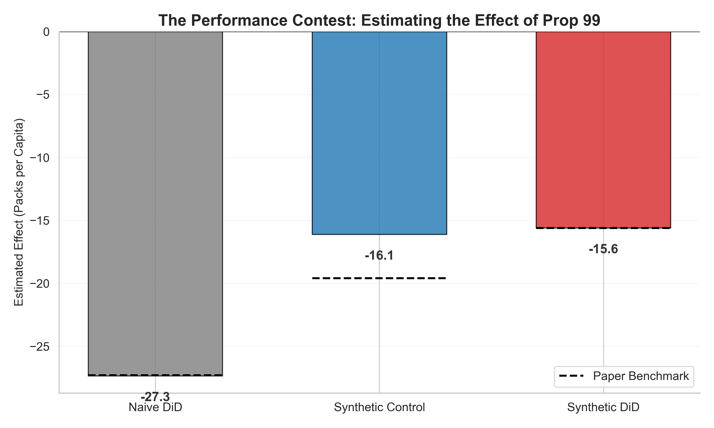

# Modern Difference-in-Differences: A Practitioner's Showcase

[](https://www.python.org/)
[](LICENSE)
[](https://github.com/pranjal-rawat/did_designs)

**Stop running `reg y x post` blindly.**

This repository implements the modern econometrics of Difference-in-Differences (DiD). It follows a **"Forward-Engineering"** philosophy: instead of starting with a regression equation, we start with the **Target Parameter**, build the estimator manually from **First Principles**, and only then verify it with packages.

Based on the framework by *Baker, Callaway, Cunningham, Goodman-Bacon, and Sant'Anna (2025)*.

---

## The Design Gallery

---

### 01. Canonical 2x2 — *The Foundation*

**Dataset:** Card & Krueger (1994) — NJ/PA Minimum Wage


**The Core Insight:** DiD is just four numbers and subtraction. The dashed line shows the counterfactual—what would have happened to New Jersey without the minimum wage increase. Regression is just a fancy calculator for this difference.

[View Code](01_canonical_2x2/) | [Read Theory](01_canonical_2x2/README.md)

---

### 02. Event Study — *Visualizing Dynamics*

**Dataset:** California Prop 99 (1988) — Tobacco Tax


**The Core Insight:** An event study is a series of 2x2 comparisons over time. Pre-treatment coefficients should be flat (testing parallel trends). Post-treatment coefficients reveal how the effect evolves. Everything is normalized to t = -1.

[View Code](02_event_study_2xT/) | [Read Theory](02_event_study_2xT/README.md)

---

### 03. Staggered Adoption — *The Modern Standard*

**Dataset:** mpdta — US Counties Minimum Wage (2003-2007)


**The Core Insight:** Standard TWFE fails with staggered treatment because it uses already-treated units as controls—a "bad comparison." The solution: use only *not-yet-treated* units as controls and aggregate ATT(g,t) across cohorts properly.

[View Code](03_staggered_GxT/) | [Read Theory](03_staggered_GxT/README.md)

---

### 04. Doubly Robust — *Fixing Bad Comparisons*

**Dataset:** LaLonde (1986) — NSW Job Training Program


**The Core Insight:** When treated and control groups differ on observables, parallel trends holds only *conditional* on covariates. Doubly Robust (DR) estimation combines propensity score weighting with outcome regression—if either model is correct, you get the right answer.

[View Code](04_covariates_dr/) | [Read Theory](04_covariates_dr/README.md)

---

### 05. Heterogeneous Effects — *Unmasking the Average*

**Dataset:** Medicaid Expansion — Simulated Income Subgroups


**The Core Insight:** Average effects hide the truth. A zero ATT could mean "no effect" or "positive for some, negative for others." Split the sample by subgroups, run DiD separately, and compare. Triple Difference (DDD) is just the difference of two DiDs.

[View Code](05_hte/) | [Read Theory](05_hte/README.md)

---

### 06. Robust Triple Differences — *When Covariates Differ*

**Dataset:** Maternity Mandates — Simulated with Education Covariate


**The Core Insight:** Naive DDD fails when covariates differ between target (Women) and placebo (Men) groups. The robust approach evaluates all counterfactuals at the target group's covariate distribution, eliminating bias from composition differences.

[View Code](06_triple_diff_dr/) | [Read Theory](06_triple_diff_dr/README.md)

---

### 07. Synthetic DiD — *Best of Both Worlds*

**Dataset:** California Prop 99 (1988) — Tobacco Tax



**The Core Insight:** SDID combines Synthetic Control (unit weights) with DiD (time weights). It optimizes weights to make the pre-treatment fit as parallel as possible, making it more robust than either method alone when you have a single treated unit.

[View Code](07_synthetic_did/) | [Read Theory](07_synthetic_did/README.md)

---

## Quick Start

```bash
# Clone the repository
git clone https://github.com/pranjal-rawat/did_designs.git
cd did_designs

# Install dependencies
pip install -r requirements.txt

# Run any module (each is self-contained)
python 01_canonical_2x2/main.py
python 02_event_study_2xT/main.py
python 07_synthetic_did/main.py
```

---

## The Philosophy: Forward-Engineering

Most tutorials teach you to run a command (e.g., `feols`). We teach you to **build the estimator**.

1. **Define Target** — What is the math of the ATT?
2. **Manual Build** — Code the estimator using `numpy`/`pandas` grouping and subtraction
3. **Verify** — Run the standard package and confirm the numbers match

> *If you can't build it with pandas, you don't understand it.*

---

## Datasets

| Dataset | Source | Design |
|:--------|:-------|:-------|
| Card & Krueger | Card & Krueger (1994) | Canonical 2x2 |
| California Prop 99 | Abadie et al. (2010) | Event Study & SDID |
| mpdta Min Wage | Callaway & Sant'Anna (2021) | Staggered Adoption |
| LaLonde NSW | LaLonde (1986) | Doubly Robust |
| Medicaid Expansion | Simulated | HTE & Triple Diff |
| Maternity Mandates | Simulated | Robust DDD |
| Castle Doctrine | Cheng & Hoekstra (2013) | Available for staggered |

---

## Key Insight

> **Every complex DiD design is just a weighted average of simple 2x2 comparisons.**

The modules progressively build from the canonical case to modern methods, showing how each estimator is constructed from fundamental building blocks.

---

## References

- Baker, A., Callaway, B., Cunningham, S., Goodman-Bacon, A., & Sant'Anna, P. (2025). *A Practitioner's Guide to Difference-in-Differences.*
- Callaway, B., & Sant'Anna, P. H. (2021). Difference-in-differences with multiple time periods. *Journal of Econometrics*.
- Card, D., & Krueger, A. B. (1994). Minimum wages and employment. *American Economic Review*.
- Ortiz-Villavicencio, A. & Sant'Anna, P. H. C. (2025). Doubly Robust Difference-in-Difference-in-Differences Estimators.
- Arkhangelsky, D., Athey, S., Hirshberg, D. A., Imbens, G. W., & Wager, S. (2021). Synthetic Difference-in-Differences. *American Economic Review*.

---

## License

MIT License (c) 2025 Pranjal Rawat
