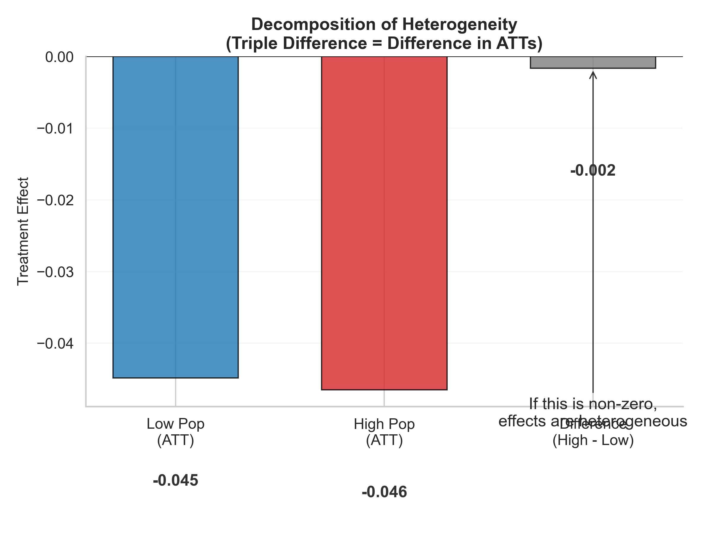
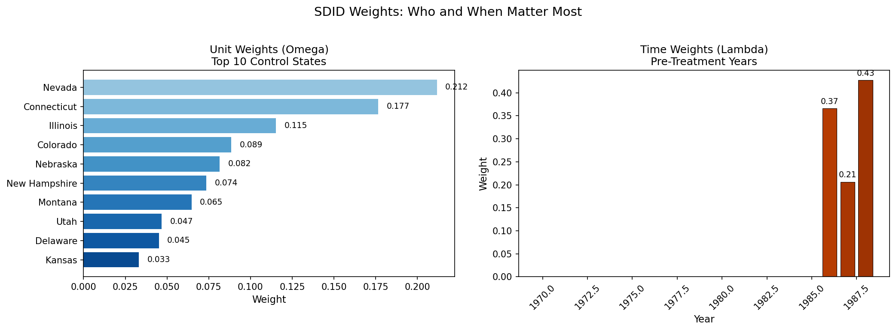

# Modern Difference-in-Differences

[](https://www.python.org/)
[](LICENSE)

Implementations of modern DiD estimators following Baker, Callaway, Cunningham, Goodman-Bacon, and Sant'Anna (2025).

## Modules

### 01. Canonical 2x2
Card & Krueger (1994) — NJ/PA Minimum Wage

| | | |
|:--:|:--:|:--:|
|  |  |  |
|  | | |

Static 2x2 design. Manual calculation vs. OLS verification.

[Code](01_canonical_2x2/) | [Notes](01_canonical_2x2/README.md)

---

### 02. Event Study (2×T)
California Prop 99 (1988) — Tobacco Tax

| | | |
|:--:|:--:|:--:|
|  |  |  |

Dynamic treatment effects with pre-trend testing. Reference period normalized to t = −1.

[Code](02_event_study_2xT/) | [Notes](02_event_study_2xT/README.md)

---

### 03. Staggered Adoption (G×T)
mpdta — US Counties Minimum Wage (2003-2007)

| | | |
|:--:|:--:|:--:|
|  |  |  |

Callaway & Sant'Anna ATT(g,t) aggregation. Not-yet-treated as controls.

[Code](03_staggered_GxT/) | [Notes](03_staggered_GxT/README.md)

---

### 04. Doubly Robust DiD
LaLonde (1986) — NSW Job Training

| | | |
|:--:|:--:|:--:|
|  |  |  |
|  |  |  |

IPW, outcome regression, and DR estimation for conditional parallel trends.

[Code](04_covariates_dr/) | [Notes](04_covariates_dr/README.md)

---

### 05. Heterogeneous Treatment Effects
Medicaid Expansion — Simulated Subgroups

| | | |
|:--:|:--:|:--:|
|  |  |  |

Subgroup analysis and triple differences (DDD).

[Code](05_hte/) | [Notes](05_hte/README.md)

---

### 06. Robust Triple Differences
Meyer, Viscusi, & Durbin (1995) — Worker's Compensation

| | | |
|:--:|:--:|:--:|
|  |  |  |

DR-DDD following Ortiz-Villavicencio & Sant'Anna (2025). Corrects for covariate imbalance between target and placebo groups.

[Code](06_triple_diff_dr/) | [Notes](06_triple_diff_dr/README.md)

---

### 07. Synthetic DiD
California Prop 99 (1988) — Tobacco Tax

| | | |
|:--:|:--:|:--:|
|  |  |  |

SDID (Arkhangelsky et al. 2021). Unit and time weights for single treated unit settings.

[Code](07_synthetic_did/) | [Notes](07_synthetic_did/README.md)

---

## Usage

```bash
pip install -r requirements.txt
python 01_canonical_2x2/main.py
```

## Datasets

| Dataset | Source | Module |
|:--------|:-------|:-------|
| Card & Krueger | Card & Krueger (1994) | 01 |
| California Prop 99 | Abadie et al. (2010) | 02, 07 |
| mpdta | Callaway & Sant'Anna (2021) | 03 |
| LaLonde NSW | LaLonde (1986) | 04 |
| Medicaid Expansion | Simulated | 05 |
| Meyer et al. (1995) | Worker's Comp | 06 |
| Castle Doctrine | Cheng & Hoekstra (2013) | — |

## Computation Results

All estimates from running each module. Reported faithfully for objective comparison.

### Module 01: Canonical 2×2 (Card & Krueger)

| Method | Estimate | Notes |
|:-------|:---------|:------|
| Manual DiD ("Four Numbers") | 2.7536 | (21.03 - 23.33) - (20.44 - 20.44) |
| OLS Regression (δ coefficient) | 2.7536 | `fte ~ treated * post` |

**Verdict:** Exact match (diff = 0.0000)

---

### Module 02: Event Study (Prop 99)

| Method | Estimate | Notes |
|:-------|:---------|:------|
| Manual ATT(t=0, 1988) | -3.64 | First post-treatment year |
| Regression ATT(t=0) | -3.64 | Event study coefficient |
| Manual ATT(t=1, 1989) | -7.18 | |
| Regression ATT(t=1) | -7.18 | |
| Avg Post-Treatment ATT | -20.24 | Average over 1988-2000 |

**Verdict:** Manual = Regression (correlation 1.000)

---

### Module 03: Staggered DiD (mpdta)

| Method | Estimate | Notes |
|:-------|:---------|:------|
| Manual ATT(2004,2004) | -0.0194 | Cohort 2004, event time 0 |
| Manual ATT(2006,2006) | +0.0047 | Cohort 2006, event time 0 |
| Manual ATT(2007,2007) | -0.0261 | Cohort 2007, event time 0 |
| Manual CS Simple ATT | -0.0568 | Average of post-treatment ATT(g,t) |
| TWFE (within-transform) | -0.0365 | Demeaned to avoid singularity |

**Verdict:** TWFE (-0.0365) differs from CS (-0.0568). TWFE biased toward zero due to bad comparisons (already-treated as controls).

---

### Module 04: Doubly Robust DiD (LaLonde)

| Method | Estimate | Notes |
|:-------|:---------|:------|
| Naive DiD | $299 | No covariate adjustment |
| IPW DiD | $1,246 | Inverse probability weighting |
| Outcome Regression | $1,692 | Predict counterfactual |
| Doubly Robust | $1,261 | Combines IPW + OR |

**Verdict:** Naive severely biased (selection on observables). DR preferred.

---

### Module 05: HTE & Triple Difference (mpdta)

| Method | Estimate | SE | Notes |
|:-------|:---------|:---|:------|
| Simple DiD (pooled) | -0.0385 | — | All counties |
| DiD (High Population) | -0.0465 | 0.190 | Above median lpop |
| DiD (Low Population) | -0.0449 | 0.193 | Below median lpop |
| DDD (High - Low) | -0.0016 | 0.279 | Difference in effects |

**Verdict:** No significant heterogeneity by county size (DDD ≈ 0).

---

### Module 06: Robust Triple Diff (Meyer et al. 1995)

| Method | Estimate | SE | Notes |
|:-------|:---------|:---|:------|
| Naive DDD (OLS) | +0.036 | 0.173 | 3-way FE with controls |
| Robust DDD (Target-Adj) | -0.118 | 0.205 | OR at target covariates |

**Verdict:** ~0.15 difference reflects covariate adjustment for age/marriage imbalance.

---

## References

- Baker, Callaway, Cunningham, Goodman-Bacon, Sant'Anna (2025). A Practitioner's Guide to Difference-in-Differences.
- Callaway & Sant'Anna (2021). Difference-in-differences with multiple time periods. *Journal of Econometrics*.
- Card & Krueger (1994). Minimum wages and employment. *AER*.
- Arkhangelsky, Athey, Hirshberg, Imbens, Wager (2021). Synthetic Difference-in-Differences. *AER*.
- Ortiz-Villavicencio & Sant'Anna (2025). Doubly Robust DDD Estimators.

## License

MIT (c) 2025 Pranjal Rawat
